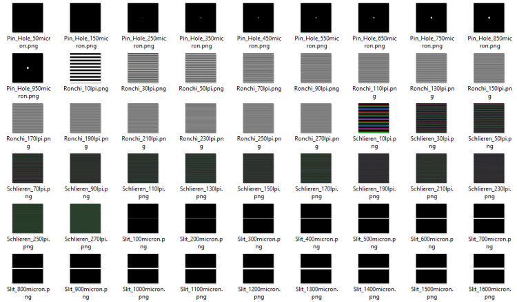

# Optical masks
Optical testing may require gratings, slits or pinholes to be put in the optical path. 
Those items can be traditionally manufactured, which is usually extremly expensive given the precision required.
Alternativly, they can be printed on a 24x36 slide.
The script below generates high definition images in PNG format, ready to be sent to a professional slide printer shop, as 24x26 slides.

This Python 3 scripts creates collections of:
- Ronchi gratings
- Pin Holes
- Slit
- Color Schierlien gratings

If you wish to get the images without running the script, pregenerated images are at: 
  https://erellaz.com/gratings
  

